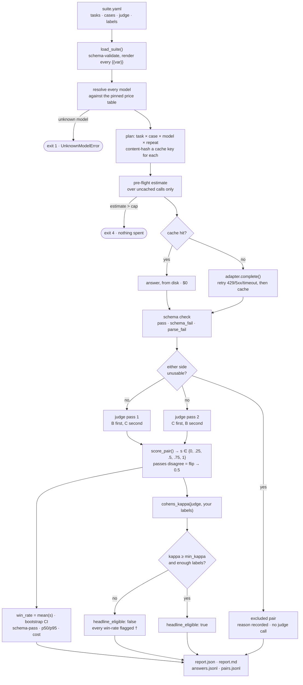

# How evalmine works

For whoever owns this next, including me in six months. It assumes the README and aims
to let you defend every number without opening the code. [docs/spec.md](../spec.md) is
the contract; this is the tour.

## The story, in one paragraph

Every model release ships with leaderboard numbers that have never predicted what the
model does to the forty-odd tasks I actually run. evalmine takes a YAML suite of my own
tasks, runs it across two or more models, and answers one question: did this change help
me, hurt me, or cost me more for the same result? It measures schema-pass rate, latency,
cost from a price table pinned to a date, and a pairwise judge win-rate against a
baseline — then measures the judge against my own labels, refusing to headline the
win-rate when it cannot show the judge agrees with me. It deliberately does no RAG eval,
no multi-turn trajectories, no fine-tuning, no UI, nothing hosted; three providers, three
MCP tools, stop. The first real result:
**[first real number — pending the owner's 40-task suite run]**.

## One run

## The code, in run order

**`cli.py` · `main()`.** argparse and nothing else: parse flags, call one library
function, format, map exceptions to the exit codes in §4. *Why:* the CLI holds no logic,
because MCP must reach the same behaviour and any rule living in `cli.py` is a rule MCP
silently lacks.

**`suite.py` · `load_suite()`.** Validates the YAML against `suite.schema.json` with
`additionalProperties: false` at every level, renders every `{{var}}`, and scans every
string for key-shaped literals. *Why:* an unmatched placeholder and an unknown key are
both hard errors, because a silently empty variable or an ignored `rubrik:` produces a
report that looks fine and means nothing.

**`prices.py` · `load_price_table()` / `resolve_all()`.** Loads the newest
`prices/prices-YYYY-MM-DD.yaml` and resolves every model in the run, judge included.
*Why:* this runs before any adapter is constructed and an unresolved string raises
`UnknownModelError` rather than defaulting, because a silent `$0.00` is how a cost
comparison becomes a lie.

**`core.py` · `run_suite()`, planning.** Expands task × case × model × repeat into flat
`CallPlan`s and computes each cache key. *Why:* the whole run is planned before any of it
executes, which is what makes a pre-flight estimate and an honest cache-hit count
possible at all.

**`cache.py` · `answer_payload()` / `cache_key()`.** SHA-256 over canonical JSON of
provider, model, system, rendered prompt, params, schema, schema mode, adapter version,
repeat index. *Why:* the date, run id, suite path and price table are deliberately not in
the key, so two runs a month apart hit the same entry; `adapter_version` is in it so
changing what an adapter sends invalidates exactly the right entries.

**`metrics.py` · `estimate_answer_cost()` / `estimate_judge_cost()`.** A chars/4 input
heuristic with output assumed maximal, over calls that are not already cache hits, plus
two judge passes per pair. *Why:* the guard lives in `core.run_suite()`, not `cli.py`, so
there is exactly one place money can be spent, and it over-estimates on purpose.

**`adapters/base.py` · `call_with_retries()`, and the four adapters.** One `Protocol`,
`complete(Request) -> Response`, hand-written POSTs to three documented endpoints, retries
only on timeout, 429 and 5xx. *Why:* no provider SDKs — three SDKs are three dependency
trees between the reader and the request; the real cost is that we learn about an API
change by breaking rather than by upgrading.

**`metrics.py` · `schema_verdict()`.** `json.loads` the whole response, else the first
fenced block, else give up: `pass`, `schema_fail`, `parse_fail`. *Why:* no brace-matching,
no repair, no retry, because a model that cannot emit JSON on request is telling you
something the harness should report rather than launder.

**`judge.py` · `exclusion_reason()` / `judge_pair()`.** Excludes pairs where either side is
unusable before spending anything, then calls the judge twice on the survivors, the two
answers in one order and then the other. *Why:* judges measurably prefer the answer they
see first, so running one order is the commonest way to publish a win-rate that is partly
an ordering artefact; the judge also never sees a model name, price, latency, or which
side is the baseline.

**`metrics.py` · `score_pair()` / `win_rate()` / `bootstrap_ci()`.** Two passes collapse to
one score in `{0, .25, .5, .75, 1}`; passes that disagree are a *flip*, scored 0.5 and
counted. *Why:* flips cancel rather than being discarded and the flip rate prints beside
the win-rate, because a win-rate over 30% flips measures order; the interval is a
bootstrap because pair scores take five values and are not Bernoulli.

**`metrics.py` · `cohens_kappa()` / `calibration_status()`.** Collapses judge and human to
three categories, computes `po`, `pe`, kappa, and the status deciding `headline_eligible`.
*Why:* kappa rather than agreement, because agreement inflates the moment one category
dominates and it will — judges learn ties are safe; `pe == 1` counts as below the floor,
since an all-tie judge agreeing with an all-tie human has shown nothing.

**`report.py` · `build_report()` / `render_markdown()`.** One JSON object every rendered
number comes from, then Markdown with calibration above the win-rates and the per-task
table sorted worst-first. *Why:* no adjectives and no recommendation anywhere in it —
judgement goes in `DECISIONS.md`, written by a person, because a report that editorialises
is one you stop reading critically.

**`mcp_server.py` · `run_suite_impl()` / `_effective_cap()`.** Three tools over stdio, each
a thin call into the same `core.py` functions. *Why three tools and not the CLI:* an agent
surface should be the smallest set of verbs that supports the decision, and every extra
tool is another way to spend money nobody authorised. *Why the cap lives in the library:*
it is a parameter of `core.run_suite()`, not a flag MCP re-implements, so the tool layer
cannot reach the provider layer any other way — the agent's default is $1.00 against the
CLI's $2.00 because the human at the CLI typed the number and the agent did not, and an
over-ceiling request is refused rather than clamped. `run_suite` returns the summary and
paths, never raw responses: those would cost the caller more than the eval did.

## The metrics

| Metric | Exact definition | What inflates it | What it cannot tell you |
|---|---|---|---|
| **schema-pass rate** | `pass / (pass + schema_fail + parse_fail)`, over tasks declaring a schema | `native` mode (the provider enforces the schema) against `prompted`; a loose schema | Whether the content is right. A model can pass every schema and be wrong every time |
| **parse_fail / schema_fail** | Not JSON at all / valid JSON violating the schema | Nothing; they are counts | They are different bugs, and are never summed into one number |
| **p50 latency** | Median of stored `latency_ms`; even `n`, mean of the middle two | Cached values from an older, faster day — read `live_fraction` | Tail behaviour. p50 is the day you had, not the day you fear |
| **p95 latency** | Nearest-rank: sorted, position `ceil(0.95n)` | Small `n` — below 20 it *is* the maximum, which is why `n` prints with it | Anything about the shape between p50 and p95 |
| **cost** | `in/1e6*in_price + out/1e6*out_price + cached_in/1e6*cached_price`, prices pinned to a date | Cache hits, which cost 0 this run — read `cost_if_uncached` beside it | Whether the table is still true. It carries the date it was read |
| **win-rate** | `mean(s)` over included pairs, `s ∈ {0,.25,.5,.75,1}` per §7.2 | Small `n` after exclusions; a judge that is also under test; flip rate above 0.30 | Whether the difference matters. Read the CI, and read it beside cost |
| **flip rate** | Pairs whose two passes disagreed / included pairs | A weak rubric; near-identical answers | Which direction the bias runs, only that order changed the verdict |
| **excluded pairs** | Either side unusable, broken out by reason | A model bad at JSON — its win-rate is then over a smaller, easier subset | Anything about quality. That is what schema-pass rate is for |
| **agreement `po`** | Judge and human matched / labelled pairs | One category dominating, usually ties | Whether the judge beats chance |
| **Cohen's kappa** | `(po - pe) / (1 - pe)` over three categories, with its Landis-Koch band | Very little; it is the honest one. `null` when `pe == 1` | Whether *your labels* are good. It measures agreement, not truth |

## How to read a report

Calibration first — printed above the win-rates for that reason. If `headline_eligible` is
false the win-rate is not a result you may quote; every figure carries `†` and the same
flag travels in `report.json` and every MCP response, so an agent cannot pass it on clean.
Then the flip rate (above 0.30 you are measuring order) and `n` (schema-passing pairs
only, so a model that fails schema is judged on an easier subset). Only then the
scorecard, reading cost *with* quality: winning 0.55 for triple the money is a different
decision from winning 0.55 for half. Finish with the per-task table, sorted worst-first,
and `evalmine compare` against the previous run — a flat headline hiding three tasks that
moved 0.4 in opposite directions is the finding you would otherwise miss. Before
publishing a number as a claim, raise `min_kappa` to 0.60.

## Interview answers

**Why build this instead of promptfoo or Braintrust?** Both are more capable: promptfoo
has far more assertion types, a viewer, red-teaming; Braintrust adds tracing, datasets
from production logs, a UI and a team. This exists for three things they do not centre —
the judge is calibrated against my labels and its number does not print when it fails, the
decision log is a first-class artefact next to the code it is about, and the surface is
small enough to read in a sitting. If those do not matter to you, use promptfoo.

**How do you know your judge is any good?** I measure it against my own preference labels
with Cohen's kappa and print the 3x3 confusion matrix. Below the floor the tool refuses to
headline the win-rate, and that flag travels into the JSON and the MCP response, so it
cannot be quoted clean. Kappa rather than raw agreement, because agreement inflates the
moment ties dominate.

**Why pairwise rather than absolute scores?** Absolute 1-to-5 judge scores drift between
runs and compress into the middle, so a 0.2 gap is mostly rubric noise. A forced choice
between two answers to the same prompt is far easier to ask consistently, and it is the
question I actually have: should I switch. The cost is that it gives only relative
quality, which is why schema-pass, latency and cost are absolute and sit beside it.

**What would make this result wrong?** A judge agreeing with me by accident (small `n`,
ties dominating, `pe` near 1); a flip rate saying the verdict follows position; labels
written after seeing the answers rather than before; a stale price table; and above all a
suite that does not represent my real work, which is the likeliest failure and the one no
statistic in the report can catch.

**How does this connect to Listenality?** Listenality has a private, product-specific
version of this pattern: a versioned prompt-eval harness, multi-model win-rates, a judge
calibrated to my labels, a cost/quality decision log. This repo is a clean-room
re-implementation of the *pattern* only: different language, no code, prompts, task data
or names carried over, example suite invented here. What carried over is structural and
fairly obvious once you have run evals for a while — separate run from score from report,
keep judgement out of the report, pin prices to a date.

**Why put an MCP surface on an eval tool?** So the eval happens at the moment of the
decision rather than after it: an agent about to swap a model can run the suite and read
the win-rate mid-task instead of a human reading a report next week. Three tools, because
an agent surface should be the smallest set of verbs that supports the decision; the cap
lives in the library, so that path cannot spend in any way the CLI could not.

## Check yourself

1. Win-rate 0.62, n=9, flip rate 0.44, kappa 0.71. Do you switch?

No. Kappa is substantial, so the judge does agree with you, but a 0.44 flip rate means
nearly half the pairs flipped verdict when the answers changed places: 0.62 is largely
presentation order. Fix the rubric, add cases, rerun.

2. Model B fails schema on 40% of cases. Why is its win-rate not low?

Because a pair where either side is `parse_fail` or `schema_fail` is excluded rather than
scored a loss (ruling O-3): otherwise a model bad at JSON loses a *quality* comparison for
a *formatting* failure. It is not forgiven — it is the headline schema-pass rate, and the
win-rate's `n` shrank, which is why that section says "over schema-passing pairs only".

3. A rerun reports $0.00 and identical latencies. What happened?

Every call was a cache hit. `cost_this_run` is 0 and `cost_if_uncached` is not; latency
comes from the values stored in the cache entries, so a cached rerun reproduces the
original timings rather than reporting ~0 ms. `live_fraction` says what share was live.

4. Kappa is `null`, status `undefined_pe_1`. Good or bad?

Bad, and treated as below the floor. `pe == 1` means both raters used a single category
throughout, usually a judge that ties everything against labels that also tie everything.
Chance agreement is 100%, so kappa is undefined, and a judge that never made a distinction
has shown nothing about its ability to make one.

5. An agent asks MCP for `max_cost: 8.00`. What happens, and why not clamp to $5?

Refused: `{"refused": true, "reason": "max_cost_exceeds_ceiling", ...}`, nothing spent.
Clamping runs a suite the caller did not ask for and hands back a number that looks
complete; a refusal makes the caller decide what to cut. Same reasoning as never
truncating a run to fit a cap.

