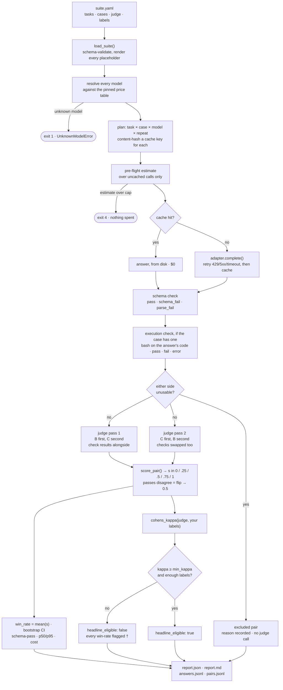

# How evalmine works

A styled, browser-readable rendering of this file lives at [how-it-works.html](how-it-works.html).

For whoever owns this next, including me in six months. It assumes the README and aims
to let you defend every number without opening the code. [docs/spec.md](../spec.md) is
the contract; this is the tour.

## The story, in one paragraph

Every model release ships with leaderboard numbers that have never predicted what the
model does to the tasks I actually run. EvalMine accepts evidence through three controlled
lanes: direct API suites, isolated multi-turn agent episodes, and completed artifacts from
an application-owned producer. It verifies provenance and experimental identity, measures
quality, reliability, latency, and cost where each applies, and calibrates its judge against
my labels before allowing a headline. Pairwise position-swap is the direct-suite default;
episode and external evidence can also use blinded N-way ranking. The product deliberately
does no RAG eval, fine-tuning, hosted UI, product database access, or external generation on
an import. On the fake example suite, the number it refuses to headline is **0.463** because
kappa 0.25 is below the 0.40 floor. That refusal is the common thesis across every lane.

## One suite run

## The other evidence lanes

**Agent episodes.** A version-2 manifest pins a git seed and expands arm × episode × repeat.
EvalMine prepares isolated copy or worktree environments, applies declared instruction and
plugin treatments, executes only behind explicit gates, verifies evidence, and builds blind
pairwise or N-way review. Objective checks and judge calls have separate authorization.

**External artifacts.** The producer owns generation and domain access. It writes completed
records with full condition identity, a shared blind-safe prompt, provenance, and optional
cost receipts. `@evalmine/harness-kit` makes that boundary executable in TypeScript. Import
hash-verifies the JSONL and makes zero provider calls; report, judge, and decide then operate
on the same evidence envelope as agent episodes.

**Workflow DAG.** Workflows coordinate contained evidence jobs and freeze their outputs. They
do not weaken the external lane's rule: arbitrary direct-API shell generation is refused.

## The code, in run order

**`cli.py` · `main()`.** argparse and nothing else: parse flags, call one library
function, format, map exceptions to the exit codes in §4. *Why:* the CLI holds no logic,
because MCP must reach the same behaviour and any rule living in `cli.py` is a rule MCP
silently lacks.

**`suite.py` · `load_suite()`.** Validates the YAML against `suite.schema.json` with
`additionalProperties: false` at every level, renders every `{{var}}`, and scans every
string for key-shaped literals. *Why:* an unmatched placeholder and an unknown key are
both hard errors, because a silently empty variable or an ignored `rubrik:` produces a
report that looks fine and means nothing.

**`prices.py` · `load_price_table()` / `resolve_all()`.** Loads the newest
`prices/prices-YYYY-MM-DD.yaml` and resolves every model in the run, judge included.
*Why:* this runs before any adapter is constructed and an unresolved string raises
`UnknownModelError` rather than defaulting, because a silent `$0.00` is how a cost
comparison becomes a lie.

**`core.py` · `run_suite()`, planning.** Expands task × case × model × repeat into flat
`CallPlan`s and computes each cache key. *Why:* the whole run is planned before any of it
executes, which is what makes a pre-flight estimate and an honest cache-hit count
possible at all.

**`cache.py` · `answer_payload()` / `cache_key()`.** SHA-256 over canonical JSON of
provider, model, system, rendered prompt, params, schema, schema mode, adapter version,
repeat index. *Why:* the date, run id, suite path and price table are deliberately not in
the key, so two runs a month apart hit the same entry; `adapter_version` is in it so
changing what an adapter sends invalidates exactly the right entries.

**`metrics.py` · `estimate_answer_cost()` / `estimate_judge_cost()`.** A chars/4 input
heuristic with output assumed maximal, over calls that are not already cache hits, plus
two judge passes per pair. *Why:* the guard lives in `core.run_suite()`, not `cli.py`, so
there is exactly one place money can be spent, and it over-estimates on purpose.

**`adapters/base.py` · `call_with_retries()`, and the four adapters.** One `Protocol`,
`complete(Request) -> Response`, hand-written POSTs to provider endpoints, retries only on
timeout, 429 and 5xx. *Why:* no provider SDK dependencies sit between the reader and the
request; the real cost is that we learn about an API change by breaking rather than by
upgrading. OpenRouter routing pins are part of the request and cache key, and its exact
response cost is preserved when returned.

**`adapters/anthropic.py` · `sampling_params_supported()` / `thinking_defaults_on()`.**
Omits `temperature` and `top_p` for Opus 4.7 and everything after it (the API returns
400 otherwise), sends `thinking: {type: disabled}` where the API would default it on,
and turns a text-less `max_tokens` stop into an empty answer instead of a fatal error.
*Why:* the suite's `max_tokens` is an answer budget. With thinking on, a model can spend
the whole budget before its first visible word, and the usage response does not itemise
thinking tokens, so nothing in the report would say why an answer came back short or
empty.

**`metrics.py` · `schema_verdict()`.** `json.loads` the whole response, else the first
fenced block, else give up: `pass`, `schema_fail`, `parse_fail`. *Why:* no brace-matching,
no repair, no retry, because a model that cannot emit JSON on request is telling you
something the harness should report rather than launder.

**`check.py` · `extract_blocks()` / `run_check()`.** Every fenced block (else the whole
answer) is written to a file in its own fresh temporary directory with every secret
stripped from the environment; `setup` lays down the fixture, `run` executes under a
timeout, exit 0 is a pass. The final block is the verdict and the earlier ones are
recorded in order; never cached. *Why:* a code task judged on prose is judged on how the
code reads. The judge and the human both get the exit code and the output beside the
answer, a failed check cannot beat a passed one (ruling O-4), and an answer that
retracts a wrong block and writes a second is scored on the second with the retraction
on record. It is the one place evalmine runs something it did not write, so fixtures
are synthetic and the directory is deleted afterwards.

**`judge.py` · `exclusion_reason()` / `judge_pair()`.** Excludes pairs where either side is
unusable before spending anything, then calls the judge twice on the survivors, the two
answers in one order and then the other. *Why:* judges measurably prefer the answer they
see first, so running one order is the commonest way to publish a win-rate that is partly
an ordering artefact; the judge also never sees a model name, price, latency, or which
side is the baseline. For a case with an execution check, both results ride along and
are swapped with the answers in pass 2.

**`metrics.py` · `score_pair()` / `win_rate()` / `bootstrap_ci()`.** Two passes collapse to
one score in `{0, .25, .5, .75, 1}`; passes that disagree are a *flip*, scored 0.5 and
counted. *Why:* flips cancel rather than being discarded and the flip rate prints beside
the win-rate, because a win-rate over 30% flips measures order; the interval is a
bootstrap because pair scores take five values and are not Bernoulli.

**`metrics.py` · `cohens_kappa()` / `calibration_status()`.** Collapses judge and human to
three categories, computes `po`, `pe`, kappa, and the status deciding `headline_eligible`.
*Why:* kappa rather than agreement, because agreement inflates the moment one category
dominates and it will — judges learn ties are safe; `pe == 1` counts as below the floor,
since an all-tie judge agreeing with an all-tie human has shown nothing.

**`report.py` · `build_report()` / `render_markdown()`.** One JSON object every rendered
number comes from, then Markdown with calibration above the win-rates and the per-task
table sorted worst-first. *Why:* no adjectives and no recommendation anywhere in it —
judgement goes in `DECISIONS.md`, worded from the owner's verdict, because a report that editorialises
is one you stop reading critically.

**`mcp_server.py` · guarded library wrappers.** Sixteen stdio tools cover suite, experiment,
external-import, and workflow lifecycles without exposing arbitrary CLI execution. The
original three suite tools remain backwards compatible. Spend, process launch, validator
commands, external writes, and workflow commands are gated independently. The cap lives in
the library, so MCP cannot reach a cheaper path around it; read-only tools return summaries
and paths, never raw provider responses.

## The metrics

| Metric | Exact definition | What inflates it | What it cannot tell you |
|---|---|---|---|
| **schema-pass rate** | `pass / (pass + schema_fail + parse_fail)`, over tasks declaring a schema | `native` mode (the provider enforces the schema) against `prompted`; a loose schema | Whether the content is right. A model can pass every schema and be wrong every time |
| **parse_fail / schema_fail** | Not JSON at all / valid JSON violating the schema | Nothing; they are counts | They are different bugs, and are never summed into one number |
| **p50 latency** | Median of stored `latency_ms`; even `n`, mean of the middle two | Cached values from an older, faster day — read `live_fraction` | Tail behaviour. p50 is the day you had, not the day you fear |
| **p95 latency** | Nearest-rank: sorted, position `ceil(0.95n)` | Small `n` — below 20 it *is* the maximum, which is why `n` prints with it | Anything about the shape between p50 and p95 |
| **cost** | `in/1e6*in_price + out/1e6*out_price + cached_in/1e6*cached_price`, prices pinned to a date | Cache hits, which cost 0 this run — read `cost_if_uncached` beside it | Whether the table is still true. It carries the date it was read |
| **win-rate** | `mean(s)` over included pairs, `s ∈ {0,.25,.5,.75,1}` per §7.2 | Small `n` after exclusions; a judge that is also under test; flip rate above 0.30 | Whether the difference matters. Read the CI, and read it beside cost |
| **flip rate** | Pairs whose two passes disagreed / included pairs | A weak rubric; near-identical answers | Which direction the bias runs, only that order changed the verdict |
| **exec pass rate** | `pass / (pass + fail + error)` over answers whose case declares a check (§6.6) | A permissive `run` script; a fixture that accepts the wrong output; a model that returns one block when asked for one | Anything about the prose. A fail is evidence for the judge, not an exclusion, so the win-rate's `n` does not shrink |
| **excluded pairs** | Either side unusable, broken out by reason | A model bad at JSON — its win-rate is then over a smaller, easier subset | Anything about quality. That is what schema-pass rate is for |
| **agreement `po`** | Judge and human matched / labelled pairs | One category dominating, usually ties | Whether the judge beats chance |
| **Cohen's kappa** | `(po - pe) / (1 - pe)` over three categories, with its Landis-Koch band | Very little; it is the honest one. `null` when `pe == 1` | Whether *your labels* are good. It measures agreement, not truth |

## How to read a report

Calibration first — printed above the win-rates for that reason. If `headline_eligible` is
false the win-rate is not a result you may quote; every figure carries `†` and the same
flag travels in `report.json` and every MCP response, so an agent cannot pass it on clean.
Then the flip rate (above 0.30 you are measuring order) and `n` (schema-passing pairs
only, so a model that fails schema is judged on an easier subset). Only then the
scorecard, reading cost *with* quality: winning 0.55 for triple the money is a different
decision from winning 0.55 for half. On a code task, read the exec pass column before
the win-rate: the judge was told a failed check cannot beat a passed one, so a win-rate
there is mostly the checks talking, and the interesting pairs are the ones where both
sides passed or both failed. Finish with the per-task table, sorted worst-first,
and `evalmine compare` against the previous run — a flat headline hiding three tasks that
moved 0.4 in opposite directions is the finding you would otherwise miss. Before
publishing a number as a claim, raise `min_kappa` to 0.60.

## Interview answers

**Why build this instead of promptfoo or Braintrust?** Both are more capable: promptfoo
has far more assertion types, a viewer, red-teaming; Braintrust adds tracing, datasets
from production logs, a UI and a team. This exists for three things they do not centre —
the judge is calibrated against my labels and its number does not print when it fails, the
decision log is a first-class artefact next to the code it is about, and the surface is
small enough to read in a sitting. If those do not matter to you, use promptfoo.

**How do you know your judge is any good?** I measure it against my own preference labels
with Cohen's kappa and print the 3x3 confusion matrix. Below the floor the tool refuses to
headline the win-rate, and that flag travels into the JSON and the MCP response, so it
cannot be quoted clean. Kappa rather than raw agreement, because agreement inflates the
moment ties dominate.

**Why pairwise or N-way rather than absolute scores?** Absolute 1-to-5 judge scores drift
between runs and compress into the middle. A forced comparison over outputs for the same
item is easier to ask consistently. Pairwise position-swap fits one baseline/candidate
decision; N-way ranking fits a complete multi-condition block without manufacturing a
large pair grid. Both remain relative, so schema, checks, latency, and cost sit beside them.

**What would make this result wrong?** A judge agreeing with me by accident (small `n`,
ties dominating, `pe` near 1); a flip rate saying the verdict follows position; labels
written after seeing the answers rather than before; a stale price table; and above all a
suite that does not represent my real work, which is the likeliest failure and the one no
statistic in the report can catch.

**How does this connect to Listenality?** Listenality has a private, product-specific
version of this pattern: a versioned prompt-eval harness, multi-model win-rates, a judge
calibrated to my labels, a cost/quality decision log. This repo is a clean-room
re-implementation of the *pattern* only: different language, no code, prompts, task data
or names carried over, example suite invented here. What carried over is structural and
fairly obvious once you have run evals for a while — separate run from score from report,
keep judgement out of the report, pin prices to a date.

**Why execute the code instead of trusting the judge?** Because a judge that reads
code grades how it reads: two bash one-liners, a win-rate, no failures, and nothing has
run either of them. A fixture and an exit code are cheap, local and never cached. The judge still decides between two answers that both pass, and sees
both outputs when they do not. The check is evidence, not a verdict — a broken fixture
would otherwise hand out losses for a bug in the harness, which is why `error` is its
own status and counts against the rate rather than against the model.

**Why put an MCP surface on an eval tool?** So evaluation happens at the moment of the
decision rather than after it. Explicit lifecycle tools let an agent validate, import,
inspect, report, and—only with the matching gates—execute or judge. The cap and containment
rules live in the same library as the CLI, so MCP cannot spend or escape by taking a separate
implementation path.

## Check yourself

1. Win-rate 0.62, n=9, flip rate 0.44, kappa 0.71. Do you switch?

No. Kappa is substantial, so the judge does agree with you, but a 0.44 flip rate means
nearly half the pairs flipped verdict when the answers changed places: 0.62 is largely
presentation order. Fix the rubric, add cases, rerun.

2. Model B fails schema on 40% of cases. Why is its win-rate not low?

Because a pair where either side is `parse_fail` or `schema_fail` is excluded rather than
scored a loss (ruling O-3): otherwise a model bad at JSON loses a *quality* comparison for
a *formatting* failure. It is not forgiven — it is the headline schema-pass rate, and the
win-rate's `n` shrank, which is why that section says "over schema-passing pairs only".

3. A rerun reports $0.00 and identical latencies. What happened?

Every call was a cache hit. `cost_this_run` is 0 and `cost_if_uncached` is not; latency
comes from the values stored in the cache entries, so a cached rerun reproduces the
original timings rather than reporting ~0 ms. `live_fraction` says what share was live.

4. Kappa is `null`, status `undefined_pe_1`. Good or bad?

Bad, and treated as below the floor. `pe == 1` means both raters used a single category
throughout, usually a judge that ties everything against labels that also tie everything.
Chance agreement is 100%, so kappa is undefined, and a judge that never made a distinction
has shown nothing about its ability to make one.

5. An agent asks MCP for `max_cost: 8.00`. What happens, and why not clamp to $5?

Refused: `{"refused": true, "reason": "max_cost_exceeds_ceiling", ...}`, nothing spent.
Clamping runs a suite the caller did not ask for and hands back a number that looks
complete; a refusal makes the caller decide what to cut. Same reasoning as never
truncating a run to fit a cap.

